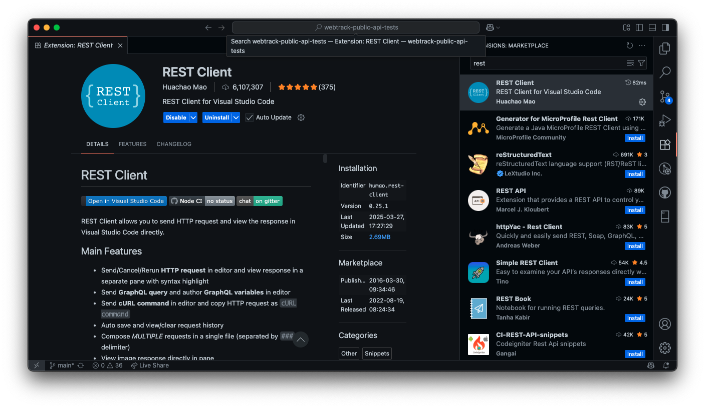
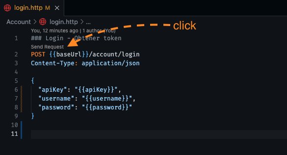
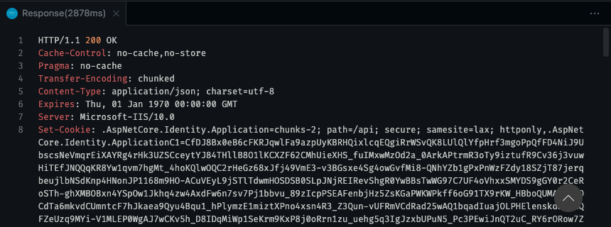

# WebTrack Public API Tests

This repository contains API tests for the WebTrack service using HTTP files with VS Code REST Client.

## 📋 Prerequisites

- [Visual Studio Code](https://code.visualstudio.com/)
- REST Client extension for VS Code

## 🔧 Installation

### 1. Install REST Client Extension

#### Option A: From VS Code Marketplace

1. Open Visual Studio Code
2. Go to the **Extensions** tab (Ctrl+Shift+X / Cmd+Shift+X)
3. Search for "REST Client" by **Huachao Mao**
4. Click **Install**



#### Option B: From command line

```bash
code --install-extension humao.rest-client
```

### 2. Configure Environment

Create the configuration file for environment variables:

1. In the project root, create the `.vscode` folder if it doesn't exist
2. Inside `.vscode`, create the `settings.json` file
3. Add the following configuration:

```json
{
  "rest-client.environmentVariables": {
      "$shared": {
          "baseUrl": "your-api-url",
          "token": "paste-your-token-here",
          "apiKey": "your-api-key",
          "username": "your-username",
          "password": "your-password"
      }
  }
}
```

**Important**: 
- Replace `"paste-your-token-here"` with your valid authentication token
- Replace `"your-username"` with your username
- Replace `"your-password"` with your password
- Change `"your-api-url"` with your API URL including the /api/v3 path

## 🚀 Usage

### 1. Configure Credentials

Before executing any request, make sure to configure your credentials in `.vscode/settings.json`:

- `username`: Your WebTrack user email
- `password`: Your password
- `baseUrl`: URL of the environment you're going to use

### 2. Get Authentication Token

1. Open the `Account/login.http` file
2. Click **"Send Request"** that appears above the request line
3. Copy the `token` from the response
4. Paste the token in the `.vscode/settings.json` file in the `"token"` field

### 3. Execute Requests

1. Open any `.http` file in the project
2. Click **"Send Request"** that appears above the request line you want to execute
3. The response will appear in a new tab





### 4. Project Structure

```
webtrack-public-api-tests/
├── Account/
│   └── login.http              # Authentication
├── Customer/
│   ├── assignLocation.http     # Assign location to customer
│   ├── delete.http            # Delete customer
│   ├── getCatalog.http        # Get customer catalog
│   ├── new.http               # Create new customer
│   ├── newWithLocations.http  # Create customer with locations
│   ├── unassignLocation.http  # Unassign location
│   └── update.http            # Update customer
├── Location/
│   ├── getCatalog.http        # Get location catalog
│   ├── new.http               # Create new location
│   └── update.http            # Update location
├── Route/
│   ├── getCatalog.http                    # Get route catalog
│   ├── newRouteAssignment.http            # New route assignment
│   ├── newRouteAssignmentWithNewRoute.http # New route with assignment
│   ├── newRouteWithExistingLocations.http # Route with existing locations
│   └── newRouteWithNewLocations.http      # Route with new locations
├── Unit/
│   └── monitoring.http        # Unit monitoring
└── .vscode/
    └── settings.json          # Variable configuration
```

## 🔑 Available Variables

- `{{baseUrl}}`: API base URL
- `{{token}}`: Bearer authentication token
- `{{apiKey}}`: API key 
- `{{username}}`: Username for authentication
- `{{password}}`: User password

## 📝 Tips

### Multiple Requests in One File
Requests are separated with `###`:

```http
### First request
GET {{baseUrl}}/endpoint1

### Second request
POST {{baseUrl}}/endpoint2
Content-Type: application/json

{
  "data": "example"
}
```

### Using Variables in Requests

```http
### Login with variables
POST {{baseUrl}}/account/login
Content-Type: application/json

{
  "apiKey": "{{apiKey}}",
  "username": "{{username}}",
  "password": "{{password}}"
}

### Example authenticated request
POST {{baseUrl}}/customers
Authorization: Bearer {{token}}
Content-Type: application/json

{
  "name": "Example Customer"
}
```

### Copy as cURL
1. Right-click on any request
2. Select **"Copy Request As cURL"**
3. Paste the command in your terminal

## 🛠️ Additional Configuration

### Change Environment
If you need to use different environments (development, production), you can modify the `settings.json`:

```json
{
  "rest-client.environmentVariables": {
      "$shared": {
          "token": "shared-token"
      },
      "development": {
          "baseUrl": "https://dev.webtrack.online/api/v3"
      },
      "production": {
          "baseUrl": "https://prod.webtrack.online/api/v3"
      }
  }
}
```

Then you can switch environments with `Ctrl+Alt+E` (Cmd+Alt+E on macOS).

## 🔍 Keyboard Shortcuts

- **Send Request**: `Ctrl+Alt+R` (Cmd+Alt+R on macOS)
- **Cancel Request**: `Ctrl+Alt+K` (Cmd+Alt+K on macOS)
- **Resend Last Request**: `Ctrl+Alt+L` (Cmd+Alt+L on macOS)
- **Switch Environment**: `Ctrl+Alt+E` (Cmd+Alt+E on macOS)
- **Request History**: `Ctrl+Alt+H` (Cmd+Alt+H on macOS)

## 🔒 Security

### Sensitive Information
- **DO NOT upload real credentials** to the repository
- The `.vscode/settings.json` file should be **local and personal**
- Use example values as placeholders:
  ```json
  {
    "username": "your-username@webtrackgps.net",
    "password": "your-password"
  }
  ```

### Best Practices
- Change credentials periodically
- Don't share your `settings.json` with real credentials
- Use different environments for development and production
---

**Note**: Make sure to keep your authentication token updated in the `settings.json` file when it expires.
